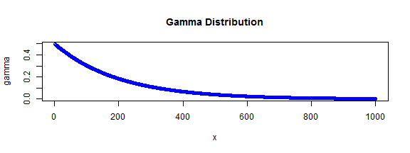
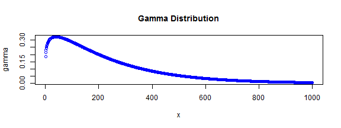

## Illustration of the Gamma Distribution

1. The Gamma Distribution
2. Density Plots
3. The Software

--- .class #id 

## The Gamma Distribution

- The gamma is useful for describing a wide range or processes where the data are positively skew. 
- It is a two-parameter distribution, where the parameters are know as shape and rate 

- The density funtion of the damma distribution is defined as:
$$latex
\frac{1}{\beta^{\alpha }\Gamma(\alpha)} x^{\alpha-1} e^{-x/{\beta}}
$$
- The parameter $\alpha$ is the shape parameter and the parameter $\beta$ is the rate parameter.

- Special cases are the exponential ($\alpha=1$) and the chi-squared ($\alpha=\nu/2, \beta=2$)

---

## Density Plots 
- We illustrate the gamma distribution for two parameter sets. First: $\alpha=1, \beta=0.5$ gives an exponential distribution:

 

Second: $alpha=1.2, \beta=0.5$ gives a  distribution with humped shape:

 

-----

## The Software
- The interactive software can be found here:  http://ttilli.shinyapps.io/assignment .
- You can set the values for $\alpha$ and $\beta$ interactivly and the graph of the gamma distribution is redrawn when you move the silders.

----

